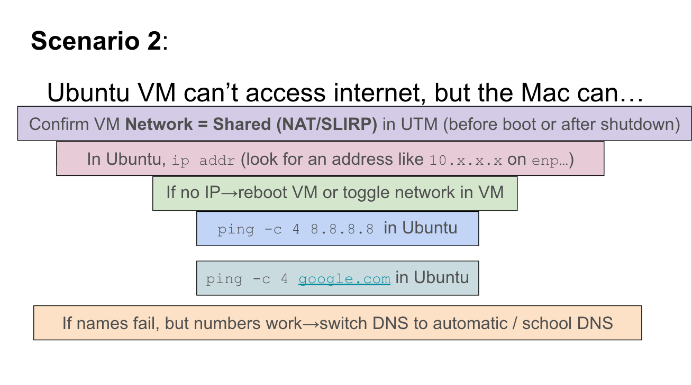
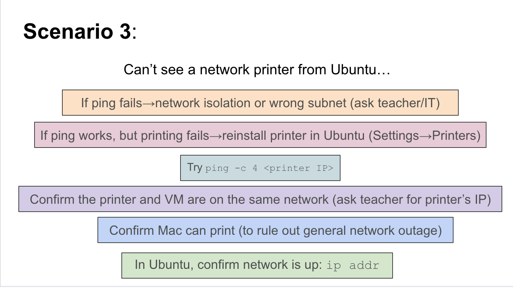
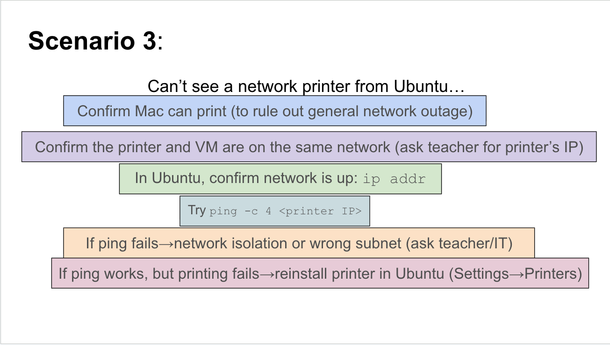
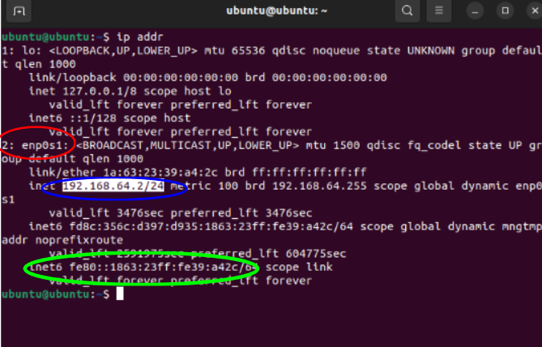

# Command Line Interface (CLI)  

## 1. Project Overview  

**Problem Statement:**  
Learn to navigate and manage a Linux system through the command line, practicing foundational Ubuntu commands while applying them in structured challenges.  

**Objectives:**  
- Navigate file systems with commands like `pwd`, `cd`, and `ls`.  
- Manage files and directories using `mkdir`, `touch`, `cp`, `rm`.  
- Apply advanced commands for hidden files, editing, and system checks.  
- Complete Map the Maze I & II activities and the House activity to demonstrate mastery.  

**Success Criteria:**  
- Correct use of CLI commands to solve navigation and file management tasks.  
- Completion of activities with correct sequences.  
- Evidence of working tests (screenshots, logs, or tables).  

---

## 2. Design & Planning – Map the Maze I, Ubuntu Tutorial, and Troubleshooting Networks

The **design and planning stage** focused on building a foundation for understanding the file tree system, working in the Ubuntu command line, and learning the necessary skills to navigate through the command line. Starting with **Map the Maze I**, it introduced me first to the different terminology for understanding file paths and how they work, such as what a parent directory is vs a root directory. After that, Map the Maze I taught me about many basic commands like `pwd` (to check my current directory), `cd` (to move into another directory), and `ls` (to see the contents of a folder). This helped me understand that the CLI requires precision: a mistyped command or wrong directory name will not work.  

At the same time, I followed the **Ubuntu tutorial**, which gave me a broader context for why these commands matter. It covered file creation (`mkdir`, `touch`) and file editing (`nano`). This tutorial complemented Map the Maze I by showing real-world uses of the same basic skills I was practicing.  

Together, Map the Maze I and the tutorial gave me the tools I needed for the next phases of the project. They also served as my “plan,” since I now had a clear set of commands I could apply to more complex tasks.  

Additionally, we began learning about troubleshooting networks, learning about the methods to and different termonlogy. Below is the four steps to check connection:
1. Check whether your device is connected. 
2. Verify if it has an IP address. 
3. Test whether it can reach the internet at all. 
4. Confirm if it can look up website names. 

### File Tree System Terminology

| Term | Definition / Example |
|------|--------------------|
| Root Directory (/ or C:\) | Very top of the file system tree. On Mac/Linux, it’s represented as a single slash `/`. On Windows, it usually starts with a drive letter, such as `C:\`. All folders and files branch downward from this starting point, like branches from the trunk of a tree. **Example:** On Windows, `C:\Users\John\Documents\essay.docx` begins at `C:\` (the root). On Mac, `/Users/John/Documents/essay.docx` begins at `/` (the root). |
| Folder (Directory) | A folder, also called a directory, is a container used to organize files and other folders. Helps organize related files. **Example:** A folder named `Documents` might contain files like `essay.docx` and `budget.xlsx` and a subfolder named `School`. |
| File | A file is a single digital object that holds data, such as text, images, video, or code. **Example:** `notes.txt` is a text file, `photo.jpg` is an image file. |
| Path | A path is the “address” of a file or folder, showing its location inside the file system. Path written as a sequence of folder names separated by slashes (`/`) on Mac/Linux or backslashes (`\`) on Windows. **Example:** Mac/Linux: `/Users/John/Documents/essay.docx` ; Windows: `C:\Users\John\Documents\essay.docx`. |
| Absolute Path | Absolute path gives the complete address of a file, starting at the root directory. **Example:** Mac/Linux: `/Users/John/Documents/essay.docx` ; Windows: `C:\Users\John\Documents\essay.docx`. |
| Relative Path | A relative path shows the location of a file or folder starting from your current working directory (where you are right now). **Example:** If your current folder is `/Users/John`, the relative path to `essay.docx` in `Documents` is `Documents/essay.docx`. |

### CLI Commands

| Command | Purpose | Example |
|---------|---------|---------|
| `pwd` | Show current directory | `/home/student` |
| `ls` | List files and folders | `ls -a` |
| `cd` | Change directory | `cd Documents` |
| `mkdir` | Create directory | `mkdir Maze` |
| `touch` | Create file | `touch clue.txt` |
| `nano` | Edit a file | `nano clue.txt` |

**Example Text Version of My File System Tree I Drew:**

# Troubleshooting Network Terms

| Term                          | Definition                                                                 |
|-------------------------------|----------------------------------------------------------------------------|
| Wi-Fi / Ethernet              | Signal carrier - ways your computer connects to the internet               |
| IP address                    | Internet Protocol - Identifiable address given to a device                 |
| Default gateway (router)      | Device to connect local network to the internet                            |
| DNS (Domain Name System)      | Like the internet’s “phonebook” translating user-friendly domain names (like google.com) into IP addresses |
| Ping                          | Method used to test connectivity between two devices (Ex. `ping -c 4 8.8.8.8`) |
| NAT / Shared networking (UTM) | Network function to pool all devices on a private network into one public IP Address before sending to external networks |
| Bridged networking (UTM)      | VM acts like a completely separate computer                                |

To test our knowledge of the terms and connection testing steps, we completed a slideshow with different problems and steps to check connection in the wrong order. Our goal was to put the different steps in the right order. Below is photos showing the before and after for each scenario:

**Scenario 1(before vs after):**

**Scenario 2(before vs after)::**

**Scenario 3(before vs after):**

---

## 3. Technical Development – Map the Maze II and Troubleshooting Network Activity  

In the **technical development stage**, I worked through **Map the Maze II**, which expanded on the basics from Maze I. This activity required me not just to move around directories, but also to create, edit, copy, and discover hidden files. For example, I used touch to create files, nano to edit their contents, and cp to duplicate them. One of the biggest lessons was using ls -a to reveal hidden files, which showed me that sometimes information is present but not visible without the right command. This activity also gave me practice in versioning: each step built on the last. At first, I simply navigated and confirmed my location. Then I began creating and editing files. Finally, I put it all together by managing multiple files and finding/creating my own hidden clues.

#### Some Commands Used and Why

| Task | Command(s) Used | Notes |
|------|----------------|-------|
| Navigate directories | `cd`, `pwd` | Used constantly to stay oriented |
| Create folder | `mkdir MazeGame` | Built a workspace |
| Create file | `touch clue1.txt` | Added clue file |
| Edit file | `nano clue1.txt` | Inserted instructions |
| Mount PC | `sudo mount -t davfs http://127.0.0.1:9843/ ~/hostshare/` | Allow sharing file from Mac to virtual Machine |
| Show hidden files | `ls -a` | Discovered hidden files in Maze Game |

**Editing clue1 and reading what was inside:**

**Sharing Clue1 onto hostshare so both mac and ubuntu can access:**

By the end of Map the Maze II, I could confidently use multiple commands together to solve more complex tasks.

### Troubleshooting Network Issues  

In addition to Map the Maze II, I also completed the **Troubleshooting Network Issues** assignment, which focused on diagnosing and fixing internet connectivity problems in both Mac and Ubuntu environments. This assignment tied directly into the four key troubleshooting steps we learned earlier:  

1. Check whether the device is connected.  
2. Verify if it has an IP address.  
3. Test whether it can reach the internet at all.  
4. Confirm if it can look up website names (DNS).  

#### Key Tasks and Results  

| Task | Command(s) Used | Findings |
|------|----------------|----------|
| Check IP on Mac | `ifconfig` | Found private IP: `10.12.17.223` (valid 10.x.x.x range) |
| Disconnect/reconnect Wi-Fi | `ifconfig` | Observed IP disappearing/reappearing when Wi-Fi toggled |
| Ping Google (8.8.8.8) | `ping -c 4 8.8.8.8` | Success, avg 7.237 ms |
| Ping Cloudflare (1.1.1.1) | `ping -c 4 1.1.1.1` | Success, avg 8.717 ms (slower than Google) |
| Find default gateway | `route -n get default` (Mac) / `ip route` (Ubuntu) | Mac: `10.32.0.1`, Ubuntu: `192.168.62.1` |
| Ping router | `ping -c 4 <gateway>` | Very fast response (0.963 ms), faster than public servers |
| Test DNS | `ping -c 4 google.com` | Successful – showed DNS was resolving correctly |
| Check IP on Ubuntu (Shared) | `ip addr` | IP: `192.168.64.2/24` (hidden behind Mac) |
| Check IP on Ubuntu (Bridged) | `ip addr` | IP: `10.32.1.33/23` (acts like its own device) |

**IP address info on Ubuntu shared mode:**
- Red is adapter name
- Blue is the IP address
- Green is MAC address

---

## 4. Testing & Evaluation – House Activity  

The **testing and evaluation stage** was the **House Activity**, which acted as the ultimate test of whether I could apply all the commands I had learned. Instead of being a linear maze, the House required me to move through rooms, inspect items, and complete tasks. This activity was a file system directory simulated as a house that I was required to navigate through. This tested not only my command knowledge but also my ability to adapt and think logically to navigate throught the different directories and find out information and even remove/edit information. For example, starting in the “hallway”, you would have to use pwd to confirm your location, then use cd to enter specific rooms like the Kitchen and ls to check what was inside. Some rooms required cleaning up files and even discovering trash(hidden files in the garage directory), so you had to be sharp and disocver hiddden files and delete with rm. Also, some tasks required creating notes using nano and leaving messages for the owner.

#### Some Commands Used and Why

| Step | Action | Command(s) | Evaluation |
|------|--------|------------|------------|
| Locate self | Check starting directory | `pwd` | Correct path displayed |
| Move to room | Enter Kitchen | `cd Kitchen` | Successful navigation to different areas of the house |
| Inspect room | List files | `ls` | Saw visible items like food (files) |
| Clean up | Delete file | `rm trash.txt` | Removed unnecessary files like garbage |
| Create note | Add message | `nano note.txt` | Left messages for the house owner |
| Reveal hidden | Show hidden items | `ls -a` | Found secret files (hidden garbage in the garage) |

**Navigating through the kitchen directory, taking out fruit and getting rid of rotten fruit:**

**Navigating through the garage directory, finding hidden trash and removing it:**

**Bugs & Fixes:**  
- Initially forgot to use `ls -a` and missed hidden files; fixed after retracing steps.  
- Used wrong capitalization (`cd kitchen` instead of `cd Kitchen`); corrected to work.  

This activity served as the final test combining skills from the Ubuntu tutorial and both Map the Maze parts.

## 5. Reflection  
Completing the CLI assignments gave me a deeper understanding of how to navigate the command line and file tree system. Through Map the Maze I & II and the House Activity, I learned that precision and attention to detail are critical: even small mistakes, like a wrong directory name or missed hidden file, can prevent progress. I also recognized the importance of planning and iteration. By breaking each activity into smaller steps, testing commands, and observing their effects, I troubleshoot and find hidden files or find the files I needed to change. The project reinforced the value of combining foundational skills with real-world application, such as mounting shared directories or managing multiple files simultaneously.
Finally, this project helped to improve my problem-solving skills and adaptability. Navigating the simulated house and discovering hidden files required logical thinking and making sure the right files were removed/editied and hidden files were found. Along with that, I am beginning to develop skills to troubleshoot networks by searching connectivity to the wifi, ip addresses over the network, and confirming through Domain Same Server(DNS). Overall, I now feel more competent in using the Linux command line and troubleshooting through networks, and I understand how these skills will support future technical challenges.
