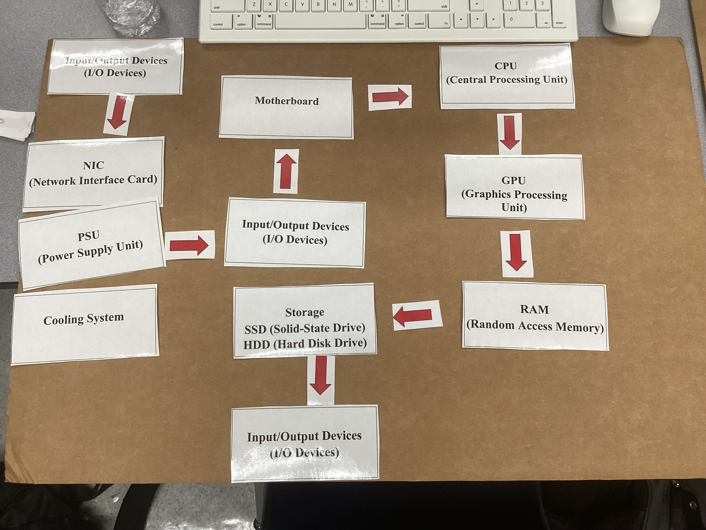
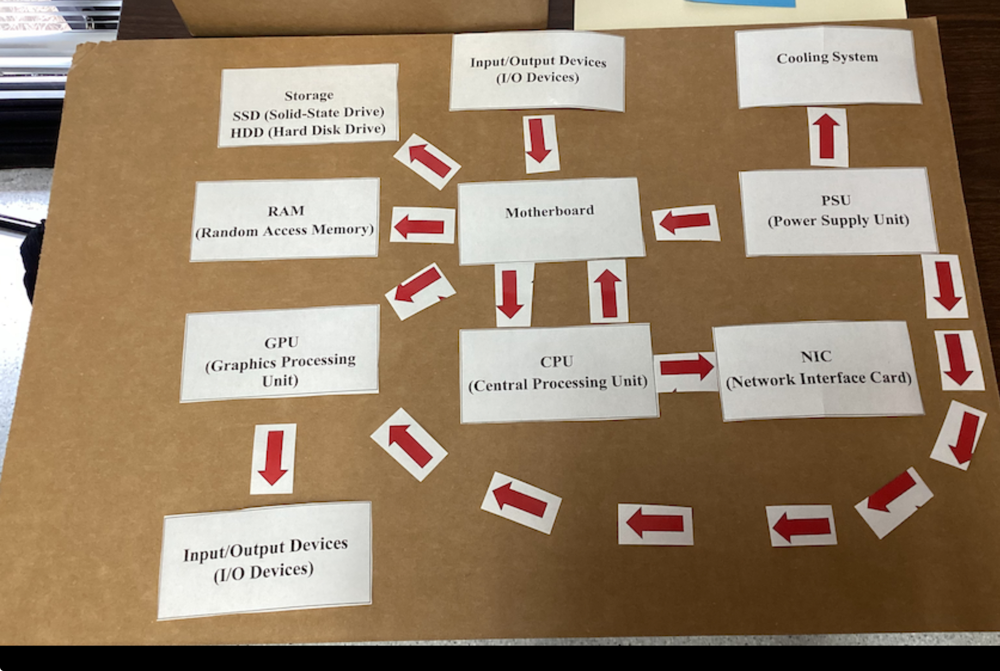

# Hardware & Software Components

## 1. Project Overview

**Problem Statement:**  
Understand the main hardware and software components of a computer, their purposes, and how they work together.

**Objectives:**  
- Identify main hardware components (CPU, RAM, GPU, etc.)  
- Describe the role of each software layer (Firmware, Drivers, OS, Libraries, Applications)  
- Explain how hardware and software interact to perform tasks  
- Map the data flow from input to storage  

**Success Criteria:**  
- Correctly understand hardware components   
- Correctly understand software layers/component
- Create flow charts describing proccesses

## 2. Design & Planning

**Hardware Activities:**  
- Arrange hardware cards to show the data path when typing a sentence and saving it  
- Materials: CPU, RAM, Storage, GPU, Motherboard, PSU, NIC, Cooling System, I/O Devices  
- Include a photo of your card arrangement

**Software Activities:**  
- Arrange software strips to show the process for downloading a file or printing a document  
- Sequence: Application -> Libraries/Runtime -> OS -> Device Drivers -> Firmware  
- Include a photo of your arranged strips

**Build-A-PC Challenge:**  
- Choose a purpose (gaming, video editing, etc.)  
- Select upgrades within a $1,000 budget  
- Fill out chart: Component, Upgrade, Why it matters  

## 3. Technical Development

**Hardware:**  
- CPU, RAM, Storage, GPU, Motherboard, PSU, NIC, Cooling System, I/O Devices  
- Version history: initial arrangement -> comparing arrangements with other people

**Software:**  
- Application, Libraries/Runtime, OS, Device Drivers, Firmware  
- Flow of data for printing or downloading tasks  
- Version History: our flow chart that we think would be the right sequence

**Build-A-PC Challenge:**  
**Decision-making Considerations:**  
- **Gaming:** Prioritize high-performance CPU and GPU to handle graphics and fast processing.  
- **Video/Photo Editing:** Prioritize more RAM and faster storage to handle large files efficiently.  
- **General Use:** Mid-range components are usually sufficient, leaving room in the budget for extra cooling or networking upgrades.  
- Different types of components (CPU, GPU, RAM) have trade-offs between cost, performance, and purpose. Choosing depends on what tasks you plan to do most often.
- This challenge gives you a variety of different componenets ranging from high end to low end for every component. This means you have to choose wisely when choosing which parts you want to have high end components vs low end components.

## 4. Testing & Evaluation

**Hardware:**  
- Test: Type a sentence and save file  
- Sequence: Had to think through the hardware component used for typing a sentence and saving them. Thought about it starting at the power all the way to the I/O Devices
- 
- Bugs: When sharing different people's boards with the entire class, everyone discovered different parts where they could have improved. In mine the motherboard wasn't  connecting directly to components like the GPU and SSD.
- Best voted classroom flowchart: 

**Software:**  
- Test: Download and print document using arranged software layers  
- Sequence for software layers only:  Application —> libraries/runtimes —> OS —> Device Drivers —> Firmware
- Sequence for software and hardware layers: Application —> libraries/runtimes —> OS —> Device Drivers —> Firmware —> RAM —> CPU —> Storage —> I/O Device
- 

**Build-A-PC Challenge:**  
- **Test:** Built PC for gaming purpose  
- **Components Chosen:**  
  - CPU: Intel Core i5 6-core ($150)  
  - RAM: 16 GB DDR4 ($150)  
  - Storage: 1 TB SSD ($250)  
  - GPU: High-end graphics card ($400)  
  - Cooling: Enhanced air cooling ($100)  
  - NIC and other upgrades as needed  
  - **Reasoning:** Gaming requires fast CPU and high-performance GPU to handle games smoothly. 16 GB RAM and 1 TB SSD provide enough speed and storage for games. Cooling was selected to prevent overheating during extended gaming sessions. Also I chose the top end GPU over the CPU since GPU's are usually more important for smoother gaming experiences.

## 5. Reflection & Analysis

I learned how hardware and software work together to perform computing tasks. The CPU acts as the brain, RAM temporarily stores data, and the GPU accelerates display and computation. Software layers allow applications to communicate with hardware through drivers and the OS. The Build-A-PC challenge helped me learn to make trade-offs to optimize for gaming, balancing cost, and performance. These lessons mirror real-world computing and network system design. By learning the basic components, we can understand how pcs function and work. If there every was a problem or a component needed to be upgraded, we could determine which one. Some next steps could include exploring cloud storage and exploring how the cli works.

