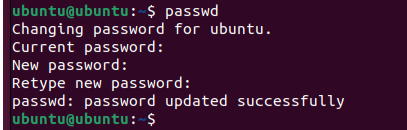
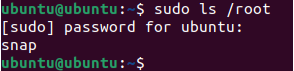
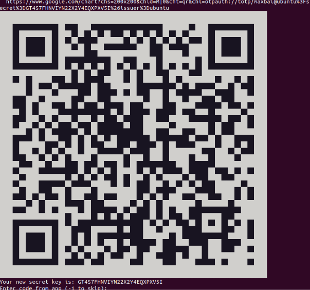
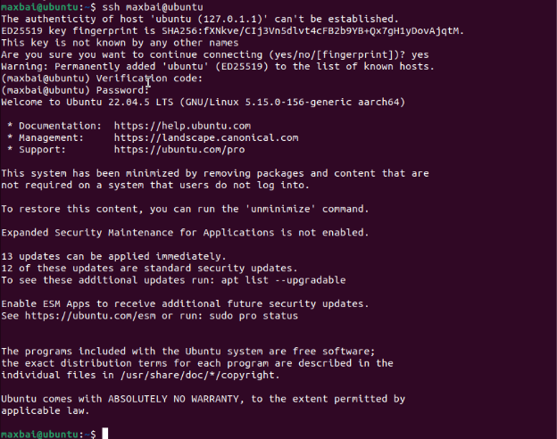
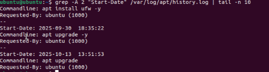
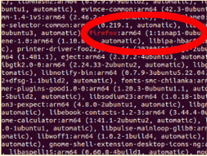

# Implementing Security for Devices

## 1. Project Overview  

**Problem Statement:**  
Understand how to strengthen device authentication and system security by designing secure passwords, enabling multi-factor authentication (MFA), and maintaining system integrity through regular software patching and updates.

**Objectives:**  
- Design a strong password algorithm that meets NIST and OWASP guidelines  
- Change the default Ubuntu password using an algorithm-generated strong password  
- Install and configure MFA (pam_google_authenticator) for secure SSH logins  
- Perform and verify system patching using Ubuntu’s update and log tools  

**Success Criteria:**  
- Password algorithm demonstrates length, complexity, and unpredictability  
- MFA setup confirmed with working verification code and SSH login test  
- System logs show successful patching activity and current updates applied  
- Reflection connects password policies, MFA, and patching to better security  

## 2. Design & Planning – Authentication Concepts & Password Algorithm

### Password Security Foundations

Strong passwords rely on three core factors: length, complexity, and unpredictability. Longer passwords increase combinations an attacker must guess, complexity adds varied character types (uppercase, lowercase, numbers, symbols), and unpredictability prevents attackers from using known patterns or personal information.

Common threats include brute force, dictionary attacks, and credential stuffing, all of which can be mitigated by using random password generation and MFA.

To strengthen authentication, industry standards such as **NIST** (National Institute of Standards and Technology) and **OWASP** (Open Worldwide Application Security Project) emphasize:  
- Favoring length over forced compelxity  
- Enabling multi-factor authentication  
- Blocking weak or reused passwords  

The below demonstrates how different authentication methods work together:  

1. Password Algorithm - ensures unpredictability  
2. MFA - adds verification beyond password  
3. Patching - protects system from known exploits  

### Designed Password Algorithm

The password generation method created for this unit used random selections of letters, numbers, and symbols to ensure unpredictability and security.

**Algorithm Steps:**

1. Pick a random letter (lowercase)
2. Pick a random number (0–9)
3. Pick a random number (0–9)
4. Pick a random letter (lowercase)
5. Pick a random letter (lowercase)
6. Pick a random letter (lowercase)
7. Pick a random letter (lowercase)
8. Pick a random number (0–9)
9. Pick a random number (0–9)
10. Pick a random symbol(!, @, #, $, %, &, *, _)
11. Pick a random number (0–9)
12. Pick a random letter (lowercase)
13. Pick a random number (0–9)
14. Pick a random letter (uppercase)
15. Pick a random number (0–9)
16. Pick a random letter (uppercase)
17. Pick a random letter (uppercase)
18. Pick a random number (0–9)
19. Pick a random symbol(!, @, #, $, %, &, *, _)
20. Pick a random symbol(!, @, #, $, %, &, *, _)
21. Pick a random number (0–9)
22. Pick a random number (0–9)

**Example Output:**  
`u95zjjw72#2q6O4Yl3*_38`

## 3. Technical Development – Implementing Authentication & Security

This phase focused on applying and verifying authentication controls in Ubuntu, including password updates, MFA setup, and patching through CLI commands.

### Changing Default Password

Using the Ubuntu terminal, the command `passwd` was executed to replace the default ubuntu password with a new one generated by the algorithm.

**Command used:** `passwd`  
**New password set:** Used password alogrithm above to generate a complex password  
**Verification:** Successful authentication tested with `sudo ls /root`, confirming that the new password functioned with administrative privileges.

Additional user management commands enhanced overall security:  
- `sudo adduser <username>` – Create a new personal account  
- `sudo usermod -aG sudo <username>` – Grant administrative permissions  
- `sudo passwd -l ubuntu` – Lock the default user account to prevent unauthorized access  

**Changing Password:**
  

**Successful Password Change:**
  

### Enabling Multi-Factor Authentication (MFA)

MFA was implemented using Google Authenticator through the following process:

**Installation**  
- `sudo apt update`  
- `sudo apt install libpam-google-authenticator -y`  

**Setup**  
- `google-authenticator` generated a QR code and secret key for time-based codes (TOTP)  

**MFA QR Code:**  
  

**Configuration**  
- SSH configuration edited to enable MFA in /etc/ssh/sshd_config  
- PAM stack modified by adding auth required pam_google_authenticator.so in /etc/pam.d/sshd  

**Testing**  
- MFA verified using simulated TOTP code from https://totp.danhersam.com  
- SSH login prompted for both password and 6-digit verification code  

**MFA Success:**  
  

### System Patching and Updates

Software patching was performed to fix vulnerabilities and ensure up-to-date security protection.

| Software | Command Used |Findings | 
|----------|-------------|----------|
| Check for updates | `sudo apt update` | 26 available updates found | 
| Install updates | `sudo apt upgrade` | Packages updated successfully | 
| Review update history | `cat /var/log/apt/history.log` | Listed dates, versions, and installed packages |
| Count installation events | `grep "Install:" /var/log/apt/history.log` | Installation events| 
| Identify recent updates | `grep -A 2 "Start-Date"` | Latest update: October 13, 2025| 
| Check specific packages | `grep "nano", grep "firefox"` | Found last updates for each program | 
| Inspect recent log | `tail -n 20 /var/log/apt/history.log` | Confirmed most recent patching session | 

**Recent Patch Updates:**
  

**Firefox Patch Update:**
  

## 4. Testing & Evaluation – Outdated Software 

All implemented security measures were tested for proper operation.

| Security Feature | Test Performed |Verification Result | 
|------------------|---------------|---------------------|
| Password Strength | `sudo ls /root` (with new password) | Access granted, confirming correct password update and admin rights | 
| MFA Authentication | SSH login prompt for verification code | Both password and generated 6-digit code required | 
| Patch Confirmation | `/var/log/apt/history.log` | Show updates installed |
| Automatic Updates | `ls -l /var/lib/apt/periodic/` | Displays schedule of files automatically updated| 

**Check Automatic Updates:**
  

### Why Patching Matters/Outdaded Software:

System patching is important because hackers can exploit known vulnerabilities that have already been patched in other systems using exploits in the wild. These unpatched systems could easily allow in data leaks and breaches through many different doors. Additionally, there may be zero-day vulnerabilities, security flaws that aren’t recognized by the user, therefore no patches available. If hackers are able to find these zero-day vulnerabilities they could easily enter the system and the fix would take a while depending on if the user even found the leak. To ensure that patching happens, you could always try to use automatic updates so the computer always stays patched and up to date.

## 5. Reflection  

Through implementing layered security controls, this unit demonstrated the practical relationship between authentication, authorization, and system maintenance. Secure passwords protect confidentiality and MFA safeguards protect integrity by ensuring that access is verified. Additionally,  consistent patching preserves availability by maintaining a functional and resilient system to both bugs and attacks.

These activities reinforced the principle that cybersecurity requires defense in depth—multiple layers working together rather than relying on a single control. The Ubuntu password algorithm exercise showed how unpredictability and length drastically reduce guessing risk. MFA through Google Authenticator demonstrated real-world two-factor authentication methods used by major organizations, adding an essential safeguard against stolen credentials and hackers.

Patching the VM provided insight into how software vulnerabilities are discovered and fixed, highlighting the importance of staying updated against known and zero-day exploits. Regular updates also prevent attackers from using exploits in the wild that target unpatched systems. Patching helps to protect against "open doors" in systems for hackers to break there way into.

Overall, this unit illustrated the importance of proactive protection to ensure cyber attacks don't happen and data isn't lost.