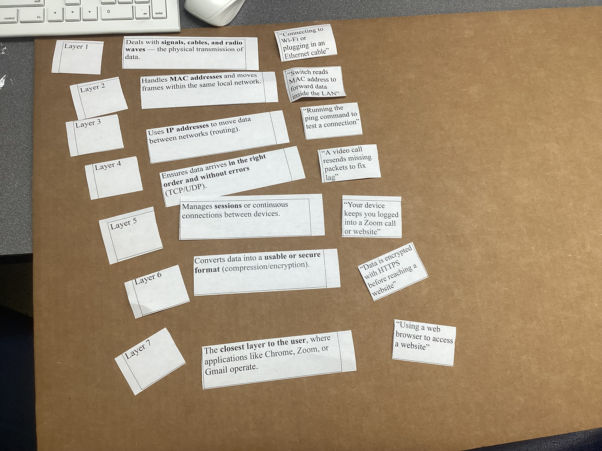

# Data Movement and Types of Networks

## 1. Project Overview  

**Problem Statement:**  
Understand how data moves across networks by exploring LAN components, the OSI and TCP/IP models, and binary/hexadecimal conversions.

**Objectives:**  

- Identify and understand the role of LAN components (hosts, switches, routers, packets)  
- Figure out OSI layer model and TCP/IP model  
- Convert between binary, decimal, and hexadecimal   
- Use Ubuntu networking tools (ifconfig, ping, traceroute, ipcalc, netstat, nc) to analyze network data movement  

**Success Criteria:**  

- Clear understanding of LAN analogy and component roles demonstrated through notes and diagrams  
- Can do binary/decimal/hexadecimal conversions   
- Complete documentation of all Ubuntu lab activities   

## 2. Design & Planning – LAN Components & Networking Models

### Understanding Local Area Networks (LAN)

Think of a Local Area Network (LAN) like a city. Every device, cable, and signal has a job, just like parts of a real city!

**Key LAN Components:**

**Computers = Houses**

- Every house has a mailbox number - ip address
- Must have a return address and a destination address

**Ethernet Cables and Wi-Fi = Roads**

- Connect devices and the roads connect all houses
- Roads let them send/receive information
- Have to have roads or there is isolation

**Switch = Traffic Roundabout**

- Sits at center of neighborhood
- Guides traffic - making sure data only goes to correct destination
- It learns the MAC address (unique hardware address) of each device plugged in
- Data comes in - switch forwards it only to device that should get it

**Router = Post Office**

- On edge of town
- Decides which mail should stay local (within LAN) and which needs to go out to the internet (Internet = big world beyond city)
- Uses IP addresses to make these decisions

**Data = Packages or Letters**

- Travels in small packages
- Each packet has:
  - Destination address (receiver's IP address)
  - Return address (sender's IP address)
  - Message = data itself

**Key Terms:**

| Key Terms | Definition | Additional Notes |
|-----------|------------|------------------|
| LAN (Local Area Network) | A network that connects computers and devices within 1 building or campus | Let devices share printers, files, and internet connections efficiently |
| Host | Any device (computer, phone, printer, tablet, server) that can send or receive data | Each host has a unique IP address |
| Switch | Connects multiple devices inside the LAN | Learns MAC addresses and forwards data only to correct device |
| Router | Connects the LAN to other networks - including the Internet | Uses IP addresses to decide destination |
| Packet | Data doesn't travel all at once - travels in chunks, called packets | Each packet has sender's IP, receiver's IP, and the payload (actual msg) |
| IP Address | Identifies each device on a network | Example: 192.168.1.25 |

**Device Connections Within a LAN Activity:**


### The OSI Model – Seven Layers of Networking

OSI(Open Systems Interconnection) - a conceptual framework that breaks down network communication.

**Phrase to Help Remeber: "Please Do Not Throw Sausage Pizza Away"**

| Layer | Name | Description |
|-------|------|-------------|
| 7 | Application | Your email or browser (final stage, human-computer interaction layer) | 
| 6 | Presentation | Translates data (encryption, compression) - ensures data in a usable form | 
| 5 | Session | Manages connection - maintains connections responsible for controlling parts and sessions | 
| 4 | Transport | Breaks data into segments - transmits data using transmission protocols including TCP and UDP | 
| 3 | Network | Routes packets using IP - decides which physical path the data will take | 
| 2 | Data Link | Transfers frames via MAC (media access control) - defines the format of data on the network | 
| 1 | Physical | Wires, signals, wi-fi - transmits raw bit streams over physical medium | 

**OSI Cards Diagram:**


### OSI vs. TCP/IP Model

| TCP/IP Layer | Corresponding OSI Layers | Functions |
|--------------|-------------------------|-----------|
| Application | 5-7 | Apps, HTTP, FTP |
| Transport | 4 | TCP/UDP, segmentation |
| Internet | 3 | IP addressing, routing |
| Network Access | 1-2 | Physical & data link |

## 3. Technical Development – Ubuntu Networking Activities

This phase focused on applying and verifying networking concepts in Ubuntu through command line tools.

### Installing Network Tools and Viewing IP Configuration

**Installation Commands:**
```bash
sudo apt update
sudo apt install net-tools -y
```

**Viewing Network Configuration:**
```bash
ifconfig
```

**Understanding the Output:**

| Term | Meaning | Purpose | Example |
|------|---------|---------|---------|
| inet | The IPv4 address assigned to the computer | It identifies the computer on the network | 192.168.64.6 — computer's unique address within your local network |
| netmask | Defines which portion of the IP address identifies the network and which part identifies the device | Helps devices know who is on the same network and who is outside it | 255.255.255.0 - the first three sets of numbers (192.168.64) identify the network, the last number (.6) identifies the specific device |
| broadcast | The broadcast address is used to send messages to all devices on the same local network | used by computers to find each other | 192.168.64.255 sends data to all devices in the 192.168.64 network |

**Network Configuration Screenshot:**


### Testing Connectivity with Ping

**Installation:**
```bash
sudo apt install iputils-ping -y
```

**Testing Commands:**
```bash
ping google.com
ping 8.8.8.8 -c 3
```

**Quick Explanation:**

| Command | Purpose | Example Output |
|---------|---------|----------------|
| ifconfig | Shows your computer's network address | 192.168.64.6 |
| ping | Tests if another computer or website is reachable | 64 bytes from google.com|
| traceroute | Shows the route data takes to reach a destination | 192.168.64.1 --> 10.0.0.1 |

**Ping Test Results:**


### Tracing Network Routes with Traceroute

**Installation:**
```bash
sudo apt install traceroute -y
```

**Testing:**
```bash
traceroute google.com
```

**My Results:**

- **How many hops:** 23 
- **How long did it take:** 3 seconds 

**Understanding traceroute Results:**

When you type `traceroute google.com`, the computer sends test packets of data toward Google's servers and keeps track of every "hop"  that those packets pass through. Each hop is like a checkpoint between your computer and the destination. The data might travel through many routers, like the school network and city network, before it finally reaches Google.

**Traceroute Results:**


### Binary, Decimal, and Hexadecimal Conversions

**Why Binary:**

- All digital data is stored + transmitted with binary (base 2) 
- Computers have signals -> "1 is on" or "0 is off" 
- Use on/off to store: 
  - IP addresses 
  - MAC addresses (unique identifier for hardware) 
  - Packets 

**Number Systems:**

**Decimal or "denary"** - humans

- 10 digits -> 0 to 9 
- Ones (10^0), tens (10^1), hundred (10^2),... 
- 345 = 3(10^2) + 4(10^1) + 5(10^0) 

**Binary** - base 2 

- Each binary digit is a bit 
- 8 bits = 1 byte 
- 4 bits = nibble 
- Example: 192.168.1.1 = 11000000.10101000.00000001.00000001 

**Hexadecimal** - base 16 

- Example: 11000000101010000000000100000001 in hex is C0A80101 
- Each hex digit = 4 bits 

**Binary to Hex to Denary Practice:**


### IP Address Analysis with ipcalc

**Checking My IP Address:**
```bash
ip a
```

**My IP Address:** 192.168.64.2/24

The IP address you see is shown in decimal form so humans can read it easily. However, your computer stores and processes it in binary, like this: 192.168.64.6 -> 11000000.10101000.01000000.00000110. Every device on the network communicates using these 1s and 0s, not the decimal numbers you see on the screen. Additionally, the /24 is called the subnet mask and it tells you how many of the 32 bits in the IP address belong to the network portion. Hexadecimal is also often used because it allows for the compression of binary numbers.

**Ipcalc:**
```bash
sudo apt install ipcalc -y
ipcalc 192.168.64.6/24
```

**Ipcalc Output Screenshot:**


### Viewing IP in Hexadecimal

**Converting to Hex:**
```bash
printf '%02X%02X%02X%02X\n' 192 168 64 6
```

Output: `C0A84006`

Each pair of hex digits represents one section (octet) of the IP address: 

- A8 = 168 
- 40 = 64 
- 06 = 6 
 
**Hexadecimal IP Screenshot:**


### VM to VM Network Communication

Understand how data travels between two computers on the same LAN using real network tools.

**Identify Your IP Address**
Same commands as above, but both VM's need to find networking information.

Commands used:
```bash
ifconfig
```
or
```bash
ip a
```


The IP addresses are how devices identify each other on a local network. Each VM will have a different IP address and devices need both to communicate.

**Test Connectivity with Ping (Layer 3 – Network Layer)**

Ping the partner VM IP address to test if connection between both VM's is stable.

Command:
```bash
ping <VM2_IP>
```

Example:
```bash
ping 192.168.64.7
```

Ping uses the ICMP protocol at the Network Layer to check if another device is reachable. Each "reply" means data successfully traveled to your partner's VM and back.

**Ping Between VMs Screenshot:**


**View Active Network Connections**

Command:
```bash
netstat -a
```

or if netstat isn't found:
```bash
sudo apt install net-tools -y
```
The netstat command displays transport layer information (Layer 4). It shows which ports are open and which protocols are being used for communication between both VM's.

**Netstat Screenshot:**


After connecting, the two VM's can communicate with each other using `netcat`.

**VM to VM Communication::**


## 4. Testing & Evaluation – Network Verification

All implemented networking concepts were tested for proper operation.

| Concept | Test Performed | Verification Result |
|---------|---------------|---------------------|
| IP Configuration | `ifconfig` command | Successfully identified inet (IP), netmask, and broadcast addresses |
| Network Connectivity | `ping google.com` and `ping 8.8.8.8` | All packets received with 22ms latency, 0% packet loss |
| Route Tracing | `traceroute google.com` | Mapped 23 hops from local gateway to Google servers in 3 seconds |
| Binary Conversion | Manual calculation verified with `bc` | All conversions accurate (e.g., 10101000 = 168) |
| Hexadecimal Analysis | `printf` command and `ipcalc` | IP address correctly displayed as C0A84002 |
| Open Ports | `netstat` | Identified open ports between 2 VM's |
| VM Communication | `ping` between VMs | Successful connectivity with low latency |
| Message Transfer | `netcat` between VMs | Text message delivered reliably using TCP |


## 5. Reflection  

Through these networking labs, I gained a practical understanding of how data moves across networks and how the OSI and TCP/IP models apply in the transmission of data across devices and networks. The LAN city analogy helped make complex ideas more. Additionally, the binary, decimal, and hexadecimal conversion exercises showed why computers use binary and how hexadecimal provides a human readable shortcut for long binary values.

Using ipcalc, ping, traceroute, and netcat helped to demonstrate the real world applications of the OSI layers. The traceroute activity showed the real world jumps between networks as it showed 23 hops my data took to reach Google’s servers and how the latency varied between them. The VM to VM activity tied everything together as it ensured I knew how to make sure two different devices where connect and could transport data between each other.

Understanding both OSI and TCP/IP clarified how each layer depends on the one below and serves the one above, an essential principle to teh success of the OSI layer and the transportation of data. Overall, these labs transformed networking from abstract theory into practical skills as I can now interpret network configurations, test connectivity, trace routes, and understand how data actually travels across the internet.
