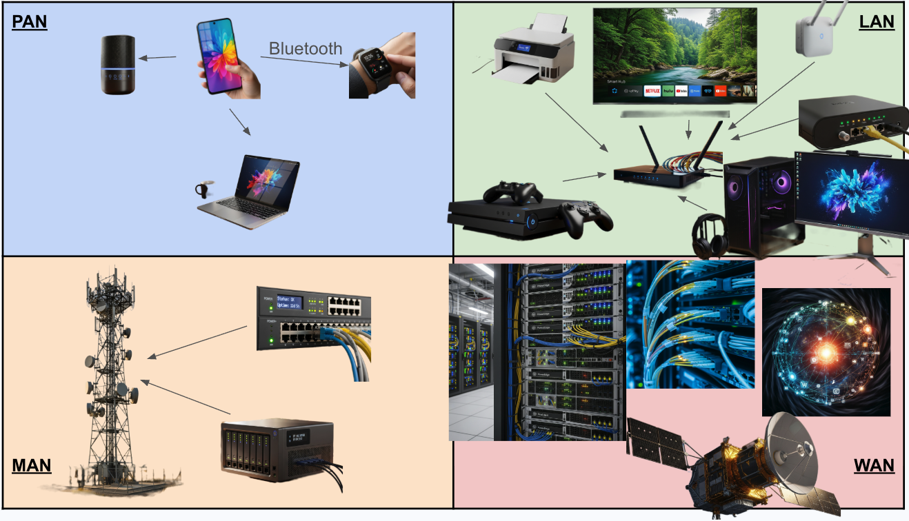
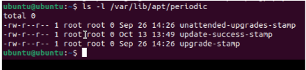

# Types of Networks & Connections and Devices

## 1. Project Overview  

**Problem Statement:**  
Understand how networks physically connect and communicate by exploring OSI Layers 1-3, building Ethernet cables, comparing network modes, designing topologies, and simulating a SOHO network.

**Objectives:**  

- Explore OSI Layer 1 and Layer 2 using Ubuntu commands
- Build and test Ethernet cables 
- Compare shared and bridged network modes and their IP addressing
- Design and label common network topologies (star, bus, ring, mesh, hybrid)
- Create and simulate a SOHO network with proper IP addressing and firewall configuration

**Success Criteria:**  

- Complete documentation of OSI Layers 1 & 2 exploration with labeled screenshots
- Successfully constructed and tested Ethernet cables with video demonstrations
- Clear comparison table showing Shared vs. Bridged mode IP addressing
- Toplogy diagrams with color-coded connections
- Functional SOHO network simulation with connectivity tests 

## 2. Design & Planning – OSI Layers and Network Design

### Understanding OSI Layers 1 and 2

The OSI Model organizes networking into seven layers, from physical hardware at the bottom to applications at the top. The first two layers form the foundation of all network communication.

**Layer 1: The Physical Layer**

The Physical Layer is the bottom layer of the OSI model and deals with hardware - the actual equipment that sends and receives electrical or optical signals. This layer is like the road system for data and includes:

- Cables (Ethernet, fiber optics, coaxial)
- Connectors and ports
- Wireless signals (Wi-Fi, Bluetooth)
- Network Interface Cards (NICs) or virtual interfaces

When a computer sends data, it turns it into bits (1s and 0s) and pushes them across these physical pathways.

**Layer 2: The Data Link Layer**

The Data Link Layer sits directly above the Physical Layer and is responsible for making sure that data travels safely and accurately between devices on the same local network. Here, data is packaged into units called frames. Each frame includes:

- The data being sent
- The source MAC address (the sender's unique hardware ID)
- The destination MAC address (the receiver's hardware ID)
- Error-checking information to detect damage during transmission

**How the Two Layers Work Together:**

Layer 1 provides the physical foundation, dealing with the actual hardware (cables, switches, NICs) and converting data into raw electrical, optical, or radio signals for transmission over the physical medium. It has no intelligence and simply moves the signal. Layer 2 operates on top of this functional Layer 1 connection, organizing the raw bits into frames and using MAC addresses for reliable, node-to-node data transfer on the local network segment. Thus, Layer 1 provides the path, while Layer 2 manages access to that path and ensures the data reaches the correct local destination intact, including error detection and control.

### Network Topologies

A network topology is the way that computers, devices, and other pieces of technology are arranged and connected within a network. It's like a map or blueprint that shows how data travels from one device to another. The topology you choose affects how well a network performs in terms of speed, cost, reliability, and scalability.

**Common Network Topologies:**

| Topology Type | Description | Common Use |
|---------------|-------------|------------|
| Star | One central switch or hub in the middle with all computers connecting to that central point | Office networks and home Wi-Fi routers |
| Bus | A single straight line ("backbone cable") with all computers branching off | Early Ethernet networks |
| Ring | Devices form a circle with connections between neighbors, data travels one way (or both in dual-ring) | Some legacy fiber networks and token ring systems |
| Mesh | Every device connects to multiple others, showing redundancy - if one path breaks, another can still carry data | Data centers and IoT or wireless mesh networks |
| Hybrid | Combine two or more types (for example, multiple Star networks connected in a Bus layout) | Large organizations with multiple departments or floors |

### SOHO Network Design

A SOHO (Small Office / Home Office) network is the kind of network setup most people use at home or in a small business. It connects multiple devices so they can share internet access, files, and other resources.

**Core SOHO Components:**

| Device | Function |
|--------|----------|
| Modem | Connects your network to your Internet Service Provider (ISP) |
| Router | Directs (routes) traffic between your local devices and the internet; assigns IP addresses |
| Switch | Expands the number of wired ports for computers and printers |
| Access Point (AP) | Provides Wi-Fi to laptops, tablets, and phones |
| Devices | Endpoints like computers, printers, and smart TVs that use the network |

**SOHO Network Diagram:**


## 3. Technical Development – Implementing Authentication & Security

### Connections that Share Data and Resources

In this activity, sort different devices into four different network types: Personal Area Network(PAN), Local Area Network(LAN), Metropolitan Area Network(MAN), Wide Area Network(WAN).
Typically, in daily life, all four different networks are used. For the PAN, it is whenever you are connecting or using different personal device, like an iPhone. For LAN's, it is often
used in your workplaces or at school. MAN's are used to connect different network across city areas, like traffic signals. Finally, WAN's are used to connect the whole world together, like the internet. 
Each network scales up and connects with both larger and smaller ones.

**Sorted Devices in Networks:**
  

**Successful Password Change:**
  

### Lab 1: Exploring OSI Layers 1 & 2

**Step 1: Identify Network Interface**

Command:
```bash
ip link show
```

This command shows all network devices on the VM. The active interface (for example, enp0s1 or eth0) was identified along with:

- Interface name: enp0s1
- MAC address: (looks something like 1a:63:23:39:a4:2c)
- Broadcast address: ff:ff:ff:ff:ff:ff

The MAC address is a unique hardware identifier that identifies the computer on the local network, while the broadcast address sends messages to every device on the network.

**ip link show Screenshot:**


**Step 2: Explore ARP (Address Resolution Protocol)**

Command:
```bash
arp -n
```

ARP connects IP addresses (Layer 3) to MAC addresses (Layer 2) so that the computer knows where to send data physically. The output shows IP addresses and MAC addresses of devices the VM has communicated with on the local network.

**arp -n Screenshot:**


**Step 3: View Network Traffic Statistics**

Command:
```bash
ip -s link
```

This command shows RX packets (received), TX packets (transmitted), and any errors. The data shows how much information has been sent and received by the VM's network interface, indicating the level of activity on the network.

**ip -s link Screenshot:**


**Step 4: Check Physical Layer Details**

Command:
```bash
sudo ethtool enp0s1
```

The ethtool command displays important information about the network interface including:

- **Speed (Mb/s):** How fast the link is
- **Duplex:** Whether data flows in both directions (full duplex) or one at a time (half duplex)
- **Link detected:** yes/no - shows whether the VM is physically connected

These results show how the VM connects at the Physical Layer (Layer 1).

**ethtool Screenshot:**


**Step 5: Capture Live Network Traffic**

Command:
```bash
sudo tcpdump -c 5
```

This command captures five live packets traveling through the VM's network interface. The output shows source and destination MAC addresses along with the protocols being used (like ARP, IP, or ICMP). This data is important for troubleshooting and network monitoring because it reveals exactly what type of traffic is moving through the network and where it's going.

**tcpdump Screenshot:**


**OSI Layers 1 & 2 Reflection:**

During my network exploration, I learned that a device's network interface identifies itself on a local network using its unique Media Access Control (MAC) address, a hardware identifier "burned into" the Network Interface Card (NIC) by the manufacturer. A key distinction is that a MAC address is a physical address operating at the Data Link Layer (Layer 2) and is only relevant within the local network segment, whereas an Internet Protocol (IP) address is a logical address operating at the Network Layer (Layer 3) and is used for global identification and routing across different networks. The Address Resolution Protocol (ARP) serves as the crucial link between these two layers: when a device needs to communicate with another device on the same local network and it only knows the destination's IP address, it sends a broadcast ARP request asking "Who has this IP address?" The device with the matching IP address then responds with its specific MAC address, which the original device caches for future direct communication. When viewing live packets in tcpdump, the ARP requests and replies were readily visible, showcasing this essential constant background activity of address resolution that facilitates data exchange. Ultimately, the Physical Layer (Layer 1) provides the physical medium (cables or wireless signals) for data transmission, while Layer 2 (Data Link Layer) organizes this raw data into frames and uses MAC addresses to ensure those frames reach the correct local device, demonstrating their combined effort to move data through the network efficiently.

### Lab 2: Cable Constructing and Testing

This lab involved building and testing Ethernet cables using the T568B wiring standard at the Physical Layer (Layer 1) of the OSI Model. Professional technicians make their own cables to create precise lengths, verify quality, and save on cost.

**T568B Wire Order Standard:**

| Pin | Wire Color (T568B) | Pair Function |
|-----|-------------------|---------------|
| 1 | White/Orange | Transmit + |
| 2 | Orange | Transmit - |
| 3 | White/Green | Receive + |
| 4 | Blue | Unused / Power |
| 5 | White/Blue | Unused / Power |
| 6 | Green | Receive - |
| 7 | White/Brown | Unused |
| 8 | Brown | Unused |

**Day 1: Stripping, Arranging, and Crimping**

**Step 1: Prepare the Cable**

Using the Solsop Pass Through RJ45 Crimp Tool Kit, I measured approximately 12 inches of Cat5e cable, made a clean cut, and used the stripper to remove about one inch of the outer plastic jacket to expose four twisted pairs (eight wires total).

**Stripped Cable Screenshot:**


**Step 2: Untwist and Arrange the Wires**

I carefully untwisted the four pairs and arranged them in the T568B color order: White/Orange, Orange, White/Green, Blue, White/Blue, Green, White/Brown, Brown. The wires were straightened until flat and parallel, then trimmed evenly to about ½ inch in length.

**Wires Aligned Screenshot:**


**Step 3: Insert Wires into RJ45 Connector**

The eight wires were carefully slid into the RJ45 connector while maintaining the correct color order. Each wire reached the front of the connector and was visible through the clear plastic, with the outer cable jacket extending slightly inside for strength.

**Wires in Connector Screenshot:**


**Step 4: Crimp the Connector**

The RJ45 connector was inserted into the crimping slot of the Solsop tool and the handles were squeezed firmly until a click was heard. The crimp tool pressed the metal contacts into the wires and cut off the excess ends. Both ends of the cable were completed using this process.

**Both Cable Ends Screenshot:**


**Stripping Demonstration Video:**
[Video showing stripping and wire preparation process]

**Day 2: Testing and Troubleshooting**

**Step 1: Test the Cable**

Both ends of the cable were plugged into the cable tester (main unit and remote unit). The indicator lights labeled 1-8 blinked in order, confirming that all eight wires were properly connected and aligned. The cable passed the test successfully.

**Cable Tester Results Screenshot:**


**Cable Testing Demonstration Video:**
[Video showing cable testing process and results]

**Optional: T568A Comparison**

A second cable was created using the T568A standard for comparison. The T568A color order is: White/Green, Green, White/Orange, Blue, White/Blue, Orange, White/Brown, Brown.

**T568A vs T568B Comparison Screenshot:**


**Cable Construction Reflection:**

The most challenging step in creating my cable was maintaining the correct wire order while inserting them into the RJ45 connector because the wires were very thin and kept moving out of alignment. Maintaining the correct wire order is critical for network reliability because even one incorrect wire will prevent the cable from passing the test and result in failed data transmission since the transmit and receive pairs must match on both ends. Building and testing cables connects directly to the Physical Layer (Layer 1) of the OSI Model because this layer deals with the actual hardware and physical signals that carry data, and the cable is the physical medium that those electrical signals travel through. In a real network, if a cable is built incorrectly but not tested, it could cause intermittent connection failures, slow data transfer speeds, or complete network outages that would be difficult to troubleshoot since the problem is hidden inside the cable. Labeling my cable and using these professional tools mirrored real-world industry practices because network technicians must clearly identify and organize cables in large installations, and using standardized wiring schemes ensures compatibility across different manufacturers and systems.

### Lab 3: Exploring IP Addresses in Shared and Bridged Mode

This lab explored how network configuration settings affect IP addressing and how virtual machines connect to the internet by comparing Shared (NAT) and Bridged network modes.

**Part 1: Shared (NAT) Mode**

**Step 1: Confirm Shared Mode and Find Internal IP**

Command:
```bash
ip a
```

In Shared (NAT) mode, the VM uses a private IP address from a virtual subnet (for example, 192.168.64.x). The UTM software acts as a translator between the VM and the real internet.

**My Internal IP Address:** 192.168.64.2/24

**Understanding the Output:**

| Term | Explanation |
|------|-------------|
| inet | This line shows the IPv4 address (192.168.64.6) |
| 192.168.64.6 | Internal (private) IP address assigned by the virtual network inside UTM (the NAT network) |
| /24 | Represents the subnet mask (255.255.255.0), meaning the first 24 bits identify the network |
| brd 192.168.64.255 | The broadcast address for this subnet |
| scope global dynamic enp0s1 | "Global" means this IP can reach outside the VM (through NAT), "dynamic" means it was assigned automatically (DHCP) |

**Shared Mode ip a Screenshot:**


**Step 2: Find External (Public) IP Address**

Using Firefox, I navigated to https://whatismyipaddress.com and recorded the external IP address.

**My External IP Address:** 173.95.44.210

This external (public) IP address represents how the rest of the internet sees the connection, and it's different from the internal IP.

**Shared Mode External IP Screenshot:**


**Shared Mode Reflection:**

My internal and external IP addresses are different. My internal IP address that starts with 192.168.64.2 belongs to my local network while the IP address starting with 173.95.44.210 belongs to the internet. The virtual machine uses NAT when connecting to the internet to conserve IP addresses - it allows multiple private IPs to connect to the same public internet IP. Being in shared mode makes it easier to connect multiple VMs on one computer because they will all share the same private IP that is connected to the internet.

**Part 2: Bridged Mode**

**Step 1: Switch to Bridged Mode**

In UTM, the network mode was changed from Shared (NAT) to Bridged (Advanced), and the VM was restarted.

**Step 2: Verify Bridged Mode and Find Internal IP**

Command:
```bash
ip a
```

**My New Internal IP Address:** 10.24.0.168

This new address comes directly from the local network's router - the VM is now a separate device on the same network as the Mac.

**Bridged Mode ip a Screenshot:**


**Step 3: Find External IP in Bridged Mode**

Using Firefox again, I navigated to https://whatismyipaddress.com.

**External IP in Bridged Mode:** 173.95.44.210 (stayed the same)

**Bridged Mode External IP Screenshot:**


**Bridged Mode Reflection:**

My internal IP address changed from 192.168.64.2 in Shared mode to 10.24.0.168 in Bridged mode because the VM was now getting its IP directly from the local network router instead of from UTM's virtual network. My external IP address remained the same at 173.95.44.210 because both modes ultimately connect to the internet through the same physical network connection. In Bridged mode, my virtual machine acts more like a separate computer on the network rather than a computer behind another device because it gets its own IP address directly from the router just like any other device. An organization might choose Bridged mode instead of Shared (NAT) mode when they need VMs to be directly accessible from other devices on the network or when they're running servers that need to be reached from outside. Security or management challenges that could come with using Bridged mode include the VM being more exposed to network attacks since it's directly on the network, and IT administrators need to manage more IP addresses and ensure each VM is properly configured with firewalls.

**Part 3: Analysis and Comparison**

**Comparison Table:**

| Mode | Internal (Private) IP | External (Public) IP | Notes |
|------|----------------------|---------------------|-------|
| Shared (NAT) | 192.168.64.2 | 173.95.44.210 | VM hidden behind Mac's connection |
| Bridged | 10.24.0.168 | 173.95.44.210 | VM appears as separate device |

**Analysis:**

Bridged mode made my VM appear as its own device on the local network because it received an IP address directly from the network router (10.24.0.168) instead of being assigned a private address by UTM's virtual network. Shared (NAT) mode provided a safer, more controlled environment because the VM is hidden behind the Mac's IP address, adding an extra layer of protection from direct network access. NAT helps manage limited IPv4 addresses by allowing multiple devices to share a single public IP address, which conserves the limited pool of available IPv4 addresses, and it improves security by hiding internal network structure from the outside world. What I learned about how data travels from a device to the internet is that there are multiple stages of translation and routing - data starts with a private IP on the local network, gets translated to a public IP by the router using NAT, travels through multiple ISP routers, and finally reaches its destination, with each layer of the OSI model playing a specific role in this journey.

### Lab 4: Network Topologies

This activity involved creating labeled drawings for five common network topologies, each showing how devices connect and communicate.

**Star Topology:**

One central switch or hub in the middle with all computers connecting to that central point. Commonly used in office networks and home Wi-Fi routers.

**Star Topology Diagram:**


**Bus Topology:**

A single straight line ("backbone cable") with all computers branching off. This was common in early Ethernet networks but is now outdated.

**Bus Topology Diagram:**


**Ring Topology:**

Devices form a circle with connections between neighbors, and data travels one way (or both in dual-ring). Used in some legacy fiber networks and token ring systems.

**Ring Topology Diagram:**


**Mesh Topology:**

Every device connects to multiple others, showing redundancy - if one path breaks, another can still carry data. Commonly used in data centers and IoT or wireless mesh networks.

**Mesh Topology Diagram:**


**Hybrid Topology:**

Combines two or more types (for example, multiple Star networks connected in a Bus layout). Used in large organizations with multiple departments or floors.

**Hybrid Topology Diagram:**


**Topology Reflection:**

Star topology would be easiest to set up for a small business because it only requires one central switch and individual cables to each device, making installation and troubleshooting straightforward since each connection is independent. Mesh topology would be the most reliable if one connection fails because every device has multiple paths to reach other devices, so if one link goes down the data can automatically reroute through another path. Mesh topology would also be most expensive to implement because it requires the most cables and network interfaces since every device must connect to multiple other devices, dramatically increasing hardware costs. I think my school uses a hybrid topology, most likely combining star topologies on each floor (with switches connecting classroom computers) that are then connected together using a bus or ring backbone between floors, because this approach provides both the simplicity of star topology locally and the scalability needed for a large building. The physical layout of a topology affects speed and reliability because the number of hops data must make impacts latency (fewer hops in star vs. many in ring), and the redundancy of connections determines fault tolerance (single point of failure in star vs. multiple paths in mesh), with more direct connections generally improving speed while more redundant paths improve reliability but increase complexity and cost.

### Lab 5: Building and Testing a SOHO Network

This lab involved designing a realistic SOHO network and simulating it using Ubuntu virtual machines to test connectivity and understand how devices communicate.

**Step 1: SOHO Network Design**

The network was designed for a small office with eight devices including 2 Ubuntu computers, 1 printer, 1 smartphone, 1 router, 1 switch, 1 access point, and 1 NAS device. The diagram shows clear labels for each device, IP addresses, and color-coded lines for wired (solid) and wireless (dashed) connections.

**IP Addressing Plan:**

- Network: 192.168.50.0/24
- Router: 192.168.50.1 (static)
- Printer: 192.168.50.10 (static)
- NAS: 192.168.50.20 (static)
- Other devices: DHCP range 192.168.50.100-200

**SOHO Network Diagram:**


**Design Explanation:**

My SOHO network uses a star topology with the router at the center connecting to a switch for wired devices and an access point for wireless devices. I connected the two Ubuntu computers and printer to the switch using Ethernet cables for reliable, fast connections since these devices frequently transfer large files. The smartphone connects wirelessly through the access point for mobility, and the NAS connects to the switch with a static IP so it's always accessible at the same address for file sharing. The router assigns dynamic IPs to most devices through DHCP but the printer and NAS have static IPs so they don't change and users can always find them on the network.

**Step 2: Simulate and Test in Ubuntu**

**A & B: Set Up and Identify IP Addresses**

Both partner VMs were set to Bridged mode and IP addresses were identified using `ip a`.

**Partner IP Addresses:**

- Computer A: 10.133.0.10
- Computer B: 10.133.0.12

**Partner IP Screenshots:**


**C: Test Connectivity Between Computers**

Command:
```bash
ping 10.133.0.12
```

Results showed successful connectivity with responses like "64 bytes from 10.133.0.12: icmp_seq=1 ttl=64 time=0.245 ms" confirming both VMs could communicate on the same network.

**Successful Ping Screenshot:**


**Step 3: Network Diagnostic Commands**

**ARP Table:**
```bash
arp -a
```

Shows nearby devices the computer recognizes on the local network with their MAC addresses, demonstrating Layer 2 (Data Link) activity.

**Routing Table:**
```bash
netstat -r
```

Displays the routing table showing how data is being sent through the network, demonstrating Layer 3 (Network) activity.

**Network Interface:**
```bash
ifconfig
```

Shows active network interfaces and IP configuration.

**Traceroute:**
```bash
sudo traceroute 8.8.8.8
```

Displays every "hop" packets take to reach Google's DNS server, visualizing how data travels through routers across different networks.

**Diagnostic Commands Screenshot:**


These commands reveal how the SOHO network communicates by showing the MAC addresses of local devices (arp), the routing decisions being made (netstat -r), and the path data takes to reach external networks (traceroute). ARP relates to Layer 2 by mapping MAC addresses on the local network, while netstat and traceroute show Layer 3 activity with routing across multiple devices.

**Step 4: Firewall Configuration**

Command:
```bash
sudo ufw status
sudo ufw enable
```

The firewall was enabled to act as a security gate for the network, blocking unwanted connections and allowing safe traffic. Firewalls operate mainly at OSI Layers 3 and 4, filtering packets based on rules.

**Active Firewall Screenshot:**


Enabling a firewall protects the system by only allowing trusted data to pass through, which prevents unauthorized access and potential security threats from reaching the computer.

**Step 5: Traceroute to Google**

Command:
```bash
traceroute google.com
```

The traceroute showed multiple hops (routers) that data traveled through to reach Google's servers. Each numbered line represents a router along the path, with fewer hops meaning a shorter route.

**Traceroute Results Screenshot:**


What I learned from the traceroute results is that data doesn't travel directly to websites but instead goes through many intermediate routers owned by different organizations and ISPs, and the path can vary based on network conditions with some routers not responding but the data still getting through.

**Step 6: Simple Web Server (Application Layer)**

**Computer A (Server):**
```bash
python3 -m http.server 8080
```

**Computer B (Client):**
Opened Firefox and navigated to `http://10.133.0.10:8080`

The browser displayed a list of files hosted by Computer A, demonstrating the Application Layer (Layer 7) by showing how one device can serve files to another over HTTP, which is the same protocol that real websites use.

**Web Server Connection Screenshot:**


## 4. Testing & Evaluation – Outdated Software 

All implemented security measures were tested for proper operation.

| Security Feature | Test Performed |Verification Result | 
|------------------|---------------|---------------------|
| Password Strength | `sudo ls /root` (with new password) | Access granted, confirming correct password update and admin rights | 
| MFA Authentication | SSH login prompt for verification code | Both password and generated 6-digit code required | 
| Patch Confirmation | `/var/log/apt/history.log` | Show updates installed |
| Automatic Updates | `ls -l /var/lib/apt/periodic/` | Displays schedule of files automatically updated| 

**Check Automatic Updates:**
  

### Why Patching Matters/Outdaded Software:

System patching is important because hackers can exploit known vulnerabilities that have already been patched in other systems using exploits in the wild. These unpatched systems could easily allow in data leaks and breaches through many different doors. Additionally, there may be zero-day vulnerabilities, security flaws that aren’t recognized by the user, therefore no patches available. If hackers are able to find these zero-day vulnerabilities they could easily enter the system and the fix would take a while depending on if the user even found the leak. To ensure that patching happens, you could always try to use automatic updates so the computer always stays patched and up to date.


## 5. Reflection  

Through implementing layered security controls, this unit demonstrated the practical relationship between authentication, authorization, and system maintenance. Secure passwords protect confidentiality and MFA safeguards protect integrity by ensuring that access is verified. Additionally,  consistent patching preserves availability by maintaining a functional and resilient system to both bugs and attacks.

These activities reinforced the principle that cybersecurity requires defense in depth—multiple layers working together rather than relying on a single control. The Ubuntu password algorithm exercise showed how unpredictability and length drastically reduce guessing risk. MFA through Google Authenticator demonstrated real-world two-factor authentication methods used by major organizations, adding an essential safeguard against stolen credentials and hackers.

Patching the VM provided insight into how software vulnerabilities are discovered and fixed, highlighting the importance of staying updated against known and zero-day exploits. Regular updates also prevent attackers from using exploits in the wild that target unpatched systems. Patching helps to protect against "open doors" in systems for hackers to break there way into.

Overall, this unit illustrated the importance of proactive protection to ensure cyber attacks don't happen and data isn't lost.
