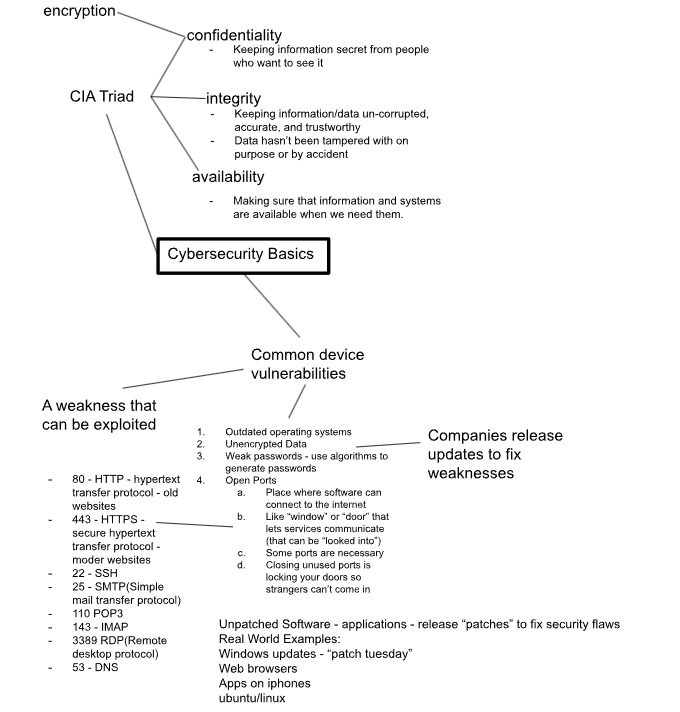
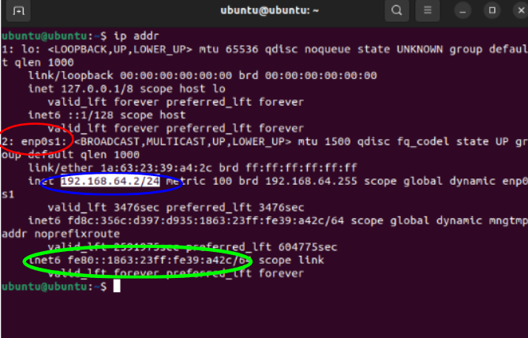
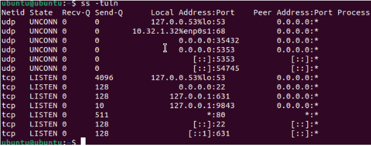
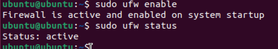
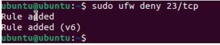
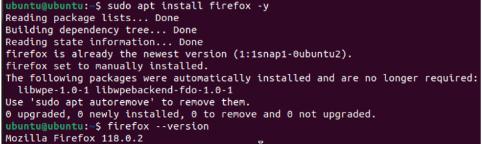

# Determining Security Controls for Devices

## 1. Project Overview  

**Problem Statement:**  
Learn how devices connect to the internet, diagnose network issues using the 4-step troubleshooting flow, and apply/discover cybersecurity strategies and systems.

cant ping because on different subnets.
**Objectives:**  
- Use Mac and Ubuntu CLI tools (`ifconfig`, `ip addr`, `ping`, `netstat`, `ufw`) to test connectivity
- Apply the 4-step troubleshooting flow  
- Identify and evaluate open network ports/services on a VM  
- Enable firewall rules (UFW) and explore encryption basics  

**Success Criteria:**  
- Correctly perform network checks on Mac and Ubuntu VMs  
- Identify security risks (extra ports, unencrypted disks)  
- Enable and test a firewall/encryptions in Ubuntu  

## 2. Design & Planning - Troubleshooting Flow & Vocabulary

### Troubleshooting Flow: Learned to always start at the endpoint device and test systematically:  
  1. Check connection (Wi-Fi/Ethernet, VM mode).  
  2. Verify IP address.  
  3. Test reachability with ping.  
  4. Confirm DNS lookups.  

### Networking Vocabulary
- **Wi-Fi/Ethernet:** ways devices connect to the internet  
- **IP address:** unique identifier for a device on the network  
- **Default gateway:** router connecting local network to the internet  
- **DNS:** translates names (google.com) to IP addresses  
- **Ping:** tests connectivity between devices  
- **NAT (shared):** VM hides behind host device  
- **Bridged networking:** VM acts like its own device  

### Cybersecurity Fundamentals – CIA Triad
- **Confidentiality:** keeping information secret from unauthorized users (e.g., encryption).  
- **Integrity:** ensuring data remains accurate, uncorrupted, and trustworthy.  
- **Availability:** making sure information and systems are accessible when needed.  

### Common Device Vulnerabilities
- **Outdated operating systems** - missing security updates.  
- **Unencrypted data** - easier for attackers to read if stolen.  
- **Weak passwords** - can be cracked - use strong/random generation.  
- **Open ports** - entry points like “doors/windows" - necessary for services but must be managed.  
  - Examples:  
    - 80 (HTTP – old websites)  
    - 443 (HTTPS – secure websites)  
    - 22 (SSH – remote login)  
    - 25 (SMTP – email transfer)  
    - 110 (POP3)  
    - 143 (IMAP)  
    - 3389 (RDP – remote desktop)  
    - 53 (DNS – domain lookups)  
- **Unpatched software** - vulnerabilities fixed by updates/patches (Windows “Patch Tuesday,” browser updates, mobile app patches).  

**Tree Diagram of Termonology:**

## 3. Technical Development – Network Testing and Cybersecurity Labs  

In the **technical development stage**, moved from theory into practical work by testing networks on both Mac and Ubuntu and applying cybersecurity measures. On Mac, began with `ifconfig` to identify my IP address. The result showed a valid private address (`10.x.x.x`), confirming that my device was connected to the school’s network. When toggling WIFI on and off, the IP disappeared and then reappeared.

Next, tested connectivity by pinging public servers. Using `ping -c 4 8.8.8.8` (google DNS) gave a fast average response time of about 7 ms. Pinging Cloudflare (`1.1.1.1`) worked as well, but slightly slower at 8 ms. To compare, pinged the school’s default gateway (`10.32.0.1`) and found it responded even faster (0.9 ms) since it was local. Finally, I confirmed DNS resolution with `ping google.com`, proving that my device could translate names to IP addresses.  

On Ubuntu, I used `ip addr` to check IP addresses in both shared (NAT) and bridged modes. Shared gave me a `192.168.x.x` address, meaning the VM was hidden behind my Mac, while bridged gave me a `10.x.x.x` address, showing the VM could act like its own device. This side-by-side testing taught me the trade-offs between convenience (shared mode) and realism (bridged mode).  

I also began applying cybersecurity practices by checking for open ports with `netstat -tuln`. Ports like 22 (SSH) and 53 (DNS) were expected, but I also saw port 631 for printing, which wasn’t needed. To improve security, I enabled Ubuntu’s firewall using `sudo ufw enable` and blocked Telnet on port 23 with `sudo ufw deny 23/tcp`. 

#### Key Tasks and Results  

| Task | Command(s) Used | Findings |
|------|----------------|----------|
| Check IP on Mac | `ifconfig` | Found private IP: `10.12.17.223` (valid 10.x.x.x range) |
| Disconnect/reconnect Wi-Fi | `ifconfig` | Observed IP disappearing/reappearing when Wi-Fi toggled |
| Ping Google (8.8.8.8) | `ping -c 4 8.8.8.8` | Success, avg 7.237 ms |
| Ping Cloudflare (1.1.1.1) | `ping -c 4 1.1.1.1` | Success, avg 8.717 ms (slower than Google) |
| Find default gateway | `route -n get default`(mac) / `ip route`(ubuntu) | Mac: `10.32.0.1`, Ubuntu: `192.168.62.1` |
| Ping router | `ping -c 4 <gateway>` | Very fast response (0.963 ms), faster than public servers |
| Test DNS | `ping -c 4 google.com` | Successful – showed DNS was resolving correctly |
| Check IP on Ubuntu (shared) | `ip addr` | IP: `192.168.64.2/24` (hidden behind Mac) |
| Check IP on Ubuntu (bridged) | `ip addr` | IP: `10.32.1.33/23` (acts like its own device) |
| Scan open ports| `netstat -tuln`| Found SSH, DNS, and unnecessary ports|
| Enable firewall| `sudo ufw enable`| Activated UFW protection|
| Block insecure service| `sudo ufw deny 23/tcp`| Closed Telnet port|

**IP address info on Ubuntu shared mode:**
- Red is adapter name
- Blue is the IP address
- Green is MAC address

**Finding the ports:**

**Enable Firewall:**

**Closed TCP Port:**

## 4. Testing & Evaluation – Outdated Software 

The **testing & evaluation** phase taught us about outdated software and potential risks. In the VM, we would use different commands to install certain softwares and test to see what verion they were. After finding out the version, the goal was to compare the version on the VM to the most updated version. In my case, most of the VM softwares was not up to date. We also had to determine the risks for the software not being up to date.

| Software | Command Used | VM Version | Why It Matters (Risk) |
|---------|-------------|----------|-----------------------|
| OpenSSL | `openssl version` | Outdated | Encrypts data on websites could be leaked |
| Firefox | `firefox --version` | Outdated | Supports open web and user privacy, web services not up to date |
| LibreOffice | `libreoffice --version` | Outdated | Alternative to commercial office suits |
| Python | `python3 --version` | Outdated | Coding languages lots of libraries built off of |
| Apache HTTP Server | `apache2 -v` | Up to Date | Web infrastructure, sites could fail |
| GIMP | `gimp --version` | Outdated | Digital editing, limited user interface |
| Java | `java -version` | Outdated | Code might not run properly |
| OpenSSH | `ssh -V` | Outdated | Secure connections to remote servers |

**Example Installing and Checking Version(Firefox):**

## 5. Reflection  

Completing these networking and cybersecurity activities gave me a much deeper understanding of both troubleshooting and defending systems. I learned that network issues can’t be just guessed at. Instead, you need to follow the steps in order: check the connection, verify IP, test reachability, and finally confirm DNS. Skipping a step could easily cause confusion and result in you not discovering the network issue. I also gained hands-on experience comparing shared and bridged networking in Ubuntu. At first, I didn’t realize how different they were, but testing made it clear: shared hides the VM behind the host, while bridged exposes it as a separate device. This helped me understand how virtualization is used differently in classrooms vs real-world IT environments. The cybersecurity labs showed me the importance of protecting systems before they are attacked. Seeing open ports as “doors” into my VM made the risks very real. Enabling the firewall and blocking Telnet taught me a way to counteract potential attacks. Checking for encryption also made me appreciate how important it is to protect data at rest, especially on personal laptops or servers. I now see how the **CIA Triad**( confidentiality, integrity, and availability) fits into everything we did. Encryption and firewalls protect confidentiality. Software patches and checks protect integrity. DNS and connectivity tests ensure availability. These three principles guided every step, from troubleshooting networks to protecting systems.
